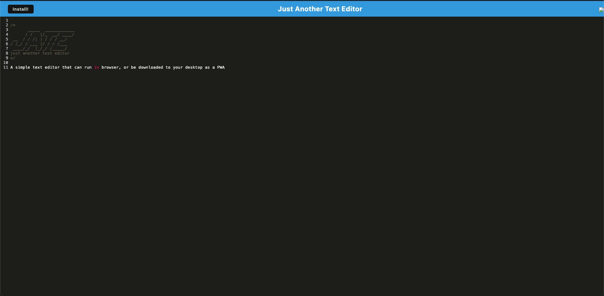

# UTA Coding Bootcamp Challenge  -- PWA Text Editor

## Description

This is my submission for the Text Editor challenge in the UTA/EdX Coding Bootcamp. This challenge aimed to create a text editor that follows Progressive Web Application guidelines.

<a href="https://pwa-text-editor-nxla.onrender.com">Link</a>

## Installation

To use in the browser, simply follow the link. To install on your device, click the install button in the upper left corner and follow your browser's directions.

## Usage

Click on a line and type. Your input will automatically be saved to a db and retrieved when you next open the app. Click on the install button in the upper left corner to download it to your machine, where it can be used in the same way.

## Credits

Starter code provided by the UTA/EdX Bootcamp.

## License

This repo uses an MIT License. See above for details.
